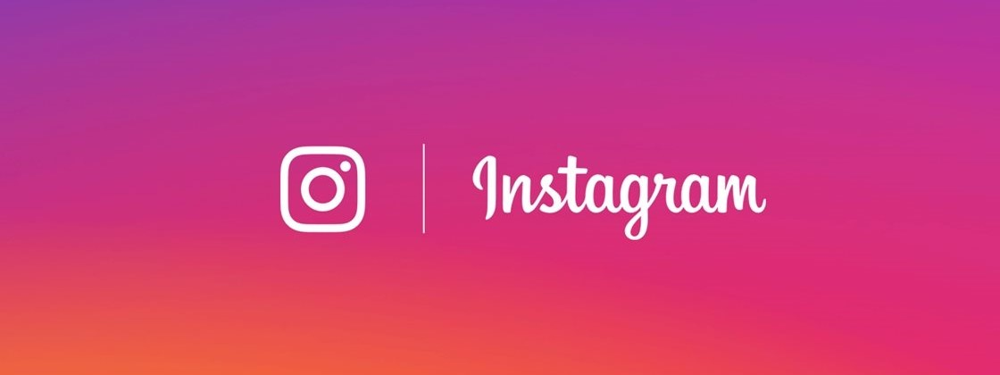

<h1 align="center"></h1>
<h1 align="center">📱 Recriando a página inicial do Instagram</h1>
<p align="center">🚀 Desafio proposto pelo bootcamp da Digital Innovaion One</p>
<h1 align="center">  </h1>

<p align="center">
 <a href="#-sobre">Sobre</a> |
 <a href="#-tecnologias">Tecnologias</a> | 
 <a href="#-como-executar">Como executar</a> | 
 <a href="#-licença">Licença</a>
</p>

## 🚀 Sobre
Este é um desafio da Digital Innovation One para treinar os conceitos de **Flexbox** e **Responsividade**. A recriação da página de login do instagram.


## 🚀 Tecnologias
As seguintes ferramentas foram usadas na construção do projeto:
- **HTML5**
- **CSS3**

## ⚡ Como executar

### Pré-requisitos
- Navegador Web
- Além disto é bom ter um editor para trabalhar com o código como [VSCode](https://code.visualstudio.com/)

### 🎲 Rodando aplicação
```bash 
# clone do repositório
$ git clone https://github.com/claudianopl/DIO-Avane-Angular

# Entrar no diretório
$ cd Recriando_Interface_Instagram

# Abrindo o projeto
$ code.
```

## 📝 Licença

Este projeto esta sobe a licença MIT.

Feito com ❤️ por Claudiano Lima 👋🏽 [Entre em contato!](linkedin.com/in/claudianopl)